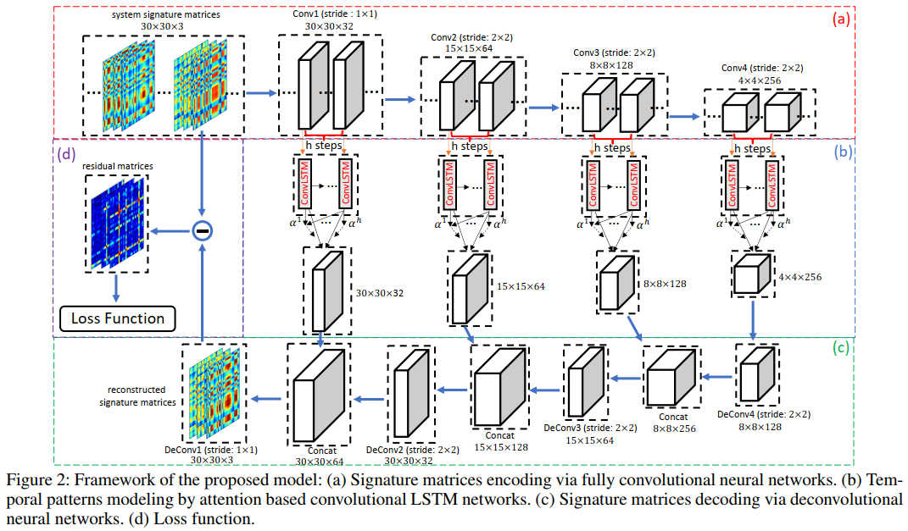

# proj120-好家伙-西安邮电大学
------


## 描述
基于eBPF技术的Linux内核可观测性是目前研究较为活跃的课题，它是一种不需要修改内核即可提取内核运行数据的技术，项目根据[proj120]([GitHub - oscomp/porj120-anomaly-detection-for-os: 实现智能的操作系统异常检测](https://github.com/oscomp/porj120-anomaly-detection-for-os))要求，利用ebpf技术提取系统/进程信息，并结合时序异常检测算法，进而分析进程信息异常。

项目包含两部分：

● 基于BCC工具编写一个可以实时监控进程信息的工具。

● 根据现有异常检测算法，设计一个适用的时间异常检测算法模型。

## 阶段报告

------


## 导师沟通

校内导师：陈莉君教授 ，校外导师：高若姝(华为)

成员：乔哲，李永恒，张纪庆

目前已和导师建立群聊，对项目实现的一些细节问题与导师进行沟通，得到导师支持。

##  技术积累

1. eBPF学习，学习调研现有的基于eBPF技术的开发的工具，包括BCC，libbpf。

2. Linux内存管理，进程调度源码学习，学习笔记：[https://gitee.com/residual_nozzle_on_dust/linux5-0-comments](https://gitee.com/residual_nozzle_on_dust/linux5-0-comments)

## 项目计划

| 工作细分 | 完成情况 |
| :--: | :--: |
| 分析内存申请路径，确定可以hook的点 | 已完成 |
| 提取进程内存使用细粒度信息 | 已完成 |
| 提取进程cpu使用信息 | 未完成 |
| 异常检测算法比较 | 已完成 |
| 数据预处理程序 | 已完成 |
| 算法模型搭建 | 已完成 |
| 模型评估程序 | 已完成 |
| 程序检错优化 | 未完成 |
| 详细技术文档 | 未完成 |


### 1. 项目设计与开发
#### 1.1 系统/进程内存信息提取设计

bcc是基于eBPF技术封装的工具。它允许使用python语言编写，将c代码嵌入内核函数。当进程执行到挂载函数时，通过int 3指令陷入内核执行相关代码，并提取当前需要的系统信息。

**设计思路：**

使用tracepoint跟踪sched_switch内核函数，获取进程task_struct结构体进而获得进程内存使用信息。

数据信息：

```c++
struct data_t {
      unsigned long nvcsw;   
      unsigned long nivcsw;
      u64 vsize;                        
      u64 size;                       
      long long rssanon;                 
      long long rssfile;             
      long long rssshmem;         
      unsigned long vswap;                
      unsigned long Hpages;    
      unsigned long Vdata;            
      unsigned long Vstk;          
      unsigned long long VPTE;
 };
```


#### 1.2 时序异常检测算法选择

异常就是偏离数据主要分布的点或者群体，异常一般分为三个类别：点异常、连续性异常、上下文异常（时间序列）。根据题目描述，课题属于时间序列异常检测这一类别。

目前比较常见的时序异常检测方法有如下五种，这里进行简单介绍。

1. 基于统计（某时刻值偏离某段时间的均值和方差值超过定义的阈值）
2. Autoregressive Moving Average (ARMA)，异常未来时间的值，如果偏离正常值一定阈值，认定异常
3. One-Class SVM（根据正常点判断新的时间是否为异常）
4. KNN（近邻的样本数量，或近邻的样本距离计算其异常）
5. AutoEncoder或者PCA降维（根据重构误差来计算是否异常，假设异常在重构时会丢失信息）

**设计思路：**

采用基于深度学习的异常检测，使用多尺度卷积循环编码器-解码器(Multi-Scale Convolutional Recurrent Encoder-Decoder ,MSCRED)构建检测模型。

**算法思想：**

通过利用每个特征在不同时间段的相似程度，从而检测出异常情况。

- 输入数据：例如存在1300个时间序列，一共30个特征，每个特征之间存在相似程度(使用内积)关系，相似程度关系使用矩阵表示为$m=[30,30,1]$，当取多个时间步长时，如取$[10,20,60]$,则相似度矩阵表示为$m=[30,30,3]$，则输入数据维度为$[1300,30,30,3]$
- 卷积操作：使用编解码网络结构的方式，将输入当作为$30*30*3$图像的方式使用卷积提取结构特征。使用多个步长为2的卷积进行下采样，来获得不同尺度的数据特征。
- LSTM操作：将卷积神经网络提取到的特征，使用LSTM操作进行捕捉历史时间数据，LSTM是捕获一维特征随时间变化的情况，但是卷积操作得到的是三维特征信息。因此采用ConvLSTM的方式，将三维特征转换为LSTM需要的数据格式，之后将对每个LSTM的输出计算每个时刻$H^i$与$H^t$（最后一个时刻）的attention系数。
- 反卷积：通过反卷积进行解码操作，通过反卷积还原初始输入矩阵。
- 计算Loss：之后通过残差来计算Loss，并根据残差的结果来计算异常。从而获得检测结果。

​       异常定义：在数据集上，通过经验确定残差特征矩阵大于给定阈值的部分。



### 2 工程概况

- 1.系统进程信息提取

  **程序环境**

  BCC ，python3.6.13

  程序文件：

  ```
  cpppp.py
  ```


- 2.时序异常检测算法模型搭建

  **算法环境：**

  Pyton3.6.13，PyTorch1.2.0

  **工程目录：**
  
  ```python
  -checkpoints #存放模型文件
  -data #存放训练文件
  --matrix_data
  -model
  --convolution_lstm.py
  --mscred.py
  -utils
  --data.py
  --matrix_generator.py
  evaluate.py
  main.py
  ```

  **主要程序文件作用：**

  `data.py`导入数据函数

  `matrix_generator.py`数据生成文件。进行输入数据的规范化操作，将时间序列准换为图像矩阵输入网络。将最终的数据按照训练集、测试集保存到`data`文件夹中。

  `mscred.py`包含CnnEncoder、CnnDecoder、attention机制，以及MSCRED结构。

  `convolution_lstm.py`定义了ConvLSTM操作

  `main.py`定义训练和测试函数

  `evaluate.py`模型评估函数，用来评估模型的准确结果，结果保存于`OUTPUTS`文件中
  
  

#### 2.4、项目文档

## 项目创建

------


### 信息提取

```python
python3 cpppp.py
```

### 异常检测

数据预处理

```
python3 matrix_generator.py
```

模型训练

```
python3 main.py
```

模型评估

```
python3 evaluate.py
```

## 参考资料

------

[1] [GitHub - iovisor/bcc: BCC - Tools for BPF-based Linux IO analysis, networking, monitoring, and more](https://github.com/iovisor/bcc)

[2] Zhang C, Song D, Chen Y, et al. A deep neural network for unsupervised anomaly detection and diagnosis in multivariate time series data[C]//Proceedings of the AAAI conference on artificial intelligence. 2019, 33(01): 1409-1416.
